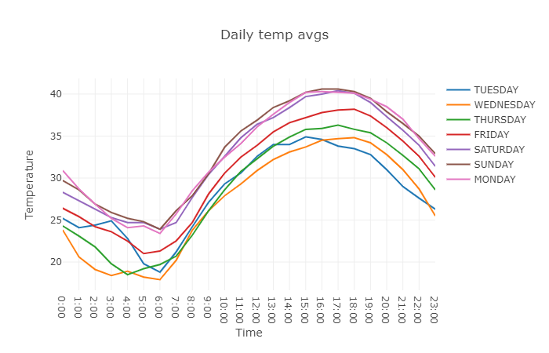

# Plotly-and-Dash
Plotly provides online graphing, analytics, and statistics tools for individuals and collaboration, as well as scientific graphing libraries for Python, R, MATLAB, Perl, Julia, Arduino, and REST. This repository consists of implementation of charts and dashoboards using Plotly.

